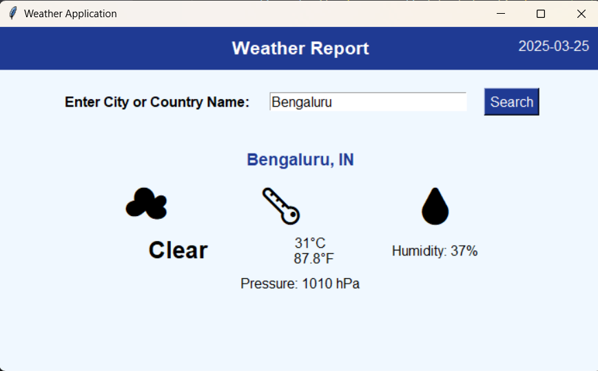
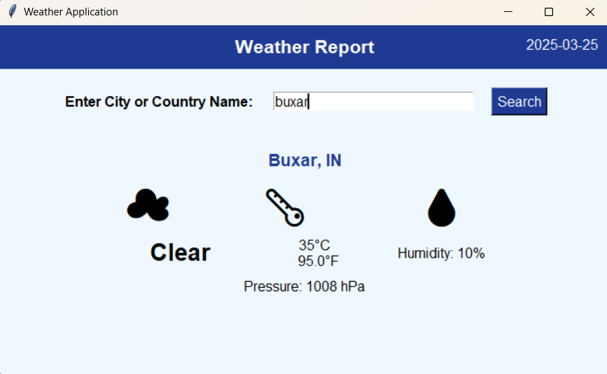

# 🌦 Weather Application  

A user-friendly Python-based desktop application that provides real-time weather information. With automatic location detection and dynamic weather icons, it makes checking the weather simple, fast, and visually engaging.

---

## 📋 Features  
- 🌍 **Automatic Location Detection**: Detects your city based on IP address.  
- 🌡️ **Real-Time Weather Data**: Displays the temperature in both Celsius and Fahrenheit.  
- ☁️ **Dynamic Weather Icons**: Emoji-based icons for current weather conditions (e.g., sunny, cloudy, rainy).  
- 🔍 **City-Based Weather Search**: Manually enter any city or country to get weather details.  
- 💧 **Humidity and Pressure**: Displays humidity percentage and atmospheric pressure.  
- 🛡️ **Error Handling**: Alerts when city input is invalid or location detection fails.

---

## 🛠️ Tech Stack  
- **Python**: Core programming language used.  
- **Tkinter**: For building the graphical user interface (GUI).  
- **Requests**: For handling HTTP requests to fetch weather and geolocation data.  
- **OpenWeatherMap API**: Provides real-time weather updates.  
- **IP-API**: Detects the user’s location based on their IP address.

---

## 🚀 How to Run the Application  

### Prerequisites  
Ensure that you have the following installed:  
- **Python 3.x**  
- Required Python Libraries:  
  - `requests`  
  - `tkinter` (usually pre-installed with Python)  

To install `requests`, run:  
```bash  
pip install requests  
```  

---

### Steps to Run  
1. Clone or download the project repository.  
2. Navigate to the project directory.  
3. Run the Python script with the following command:  
   ```bash  
   python weather_app.py  
   ```  
4. The application will launch, and it will attempt to auto-detect your location. If unsuccessful, you can manually enter a city to check the weather.

---

## 🌈 Application UI Overview  
The Weather Application UI includes:  
- **Location Display**: Shows the detected or manually entered city.  
- **Weather Details**: Temperature (°C/°F), humidity, pressure, and weather conditions.  
- **Dynamic Icons**: Emoji-based icons for current weather.  
- **Search Bar**: Allows users to input a location manually.

---

## 🔄 API Configuration  
You need to configure your own API key to fetch weather data. Follow these steps:  
1. Sign up at [OpenWeatherMap](https://openweathermap.org/) and generate a free API key.  
2. Replace the placeholder API key in the script with your key:  
   ```python  
   self.api_key = 'YOUR_API_KEY'  
   ```  

---

## 📌 Error Handling  
- **Location Detection Error**: If automatic location detection fails, a warning is displayed, allowing for manual input.  
- **City Not Found**: Alerts users when an invalid city is entered.  
- **Network Issues**: Shows an error if there are connectivity problems when accessing APIs.

---

## 📷 Screenshots  
Here’s how the Weather Application UI looks:  

- **Automatic Location Detection & Weather Display:**  
  

- **Manual City Input & Weather Details:**  
  

